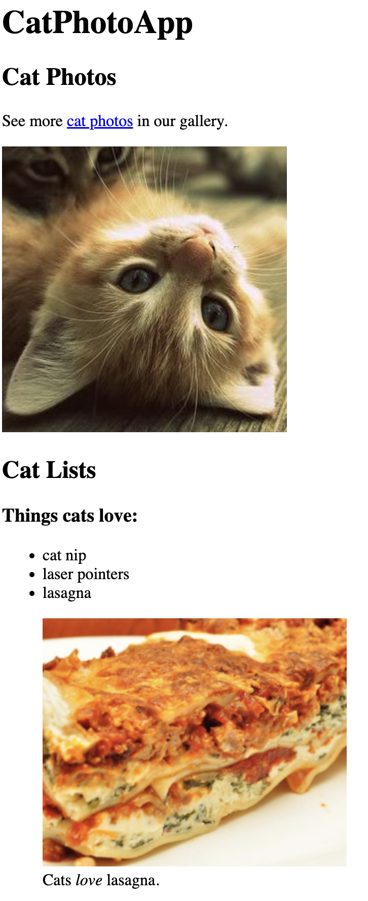
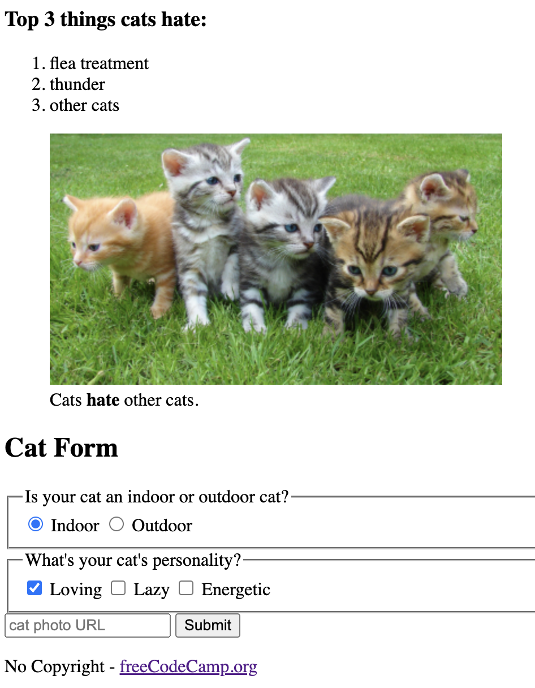

# [Cat Photo App](https://vincentz-42.github.io/freecodecamp/CatPhotoApp/)

| | |
|  |  |

## Description
* A webpage with cute photos of cats, a bullet-point list of what they love and hate, and a short questionaire form. To view the webpage, click <a href="https://vincentz-42.github.io/freecodecamp/CatPhotoApp/" target="_blank">here</a>

## Learning Objective
* To build a webpage using basic HTML elements and their attributes

## References
* This is the first project in the Responsive Web Design Certification curriculum by freeCodeCamp.org
