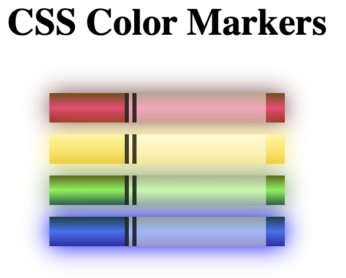

# [Color Markers](https://vincentz-42.github.io/freecodecamp/ColorMarkers/)

## Description
* A webpage that displays color markers by using various CSS coloring functions and their properties 
* To view the webpage, click [here](https://vincentz-42.github.io/freecodecamp/ColorMarkers/)

## Learning Objective
* To learn how to manipulate CSS coloring through the use of hexidecimal values and various functions (such as rgb, hsl, and linear-gradient) as well as many associated properties (such as opacity, border, and shadows)

## References
* This is the third project in the Responsive Web Design Certification curriculum by (freeCodeCamp.org)[freeCodeCamp.org]