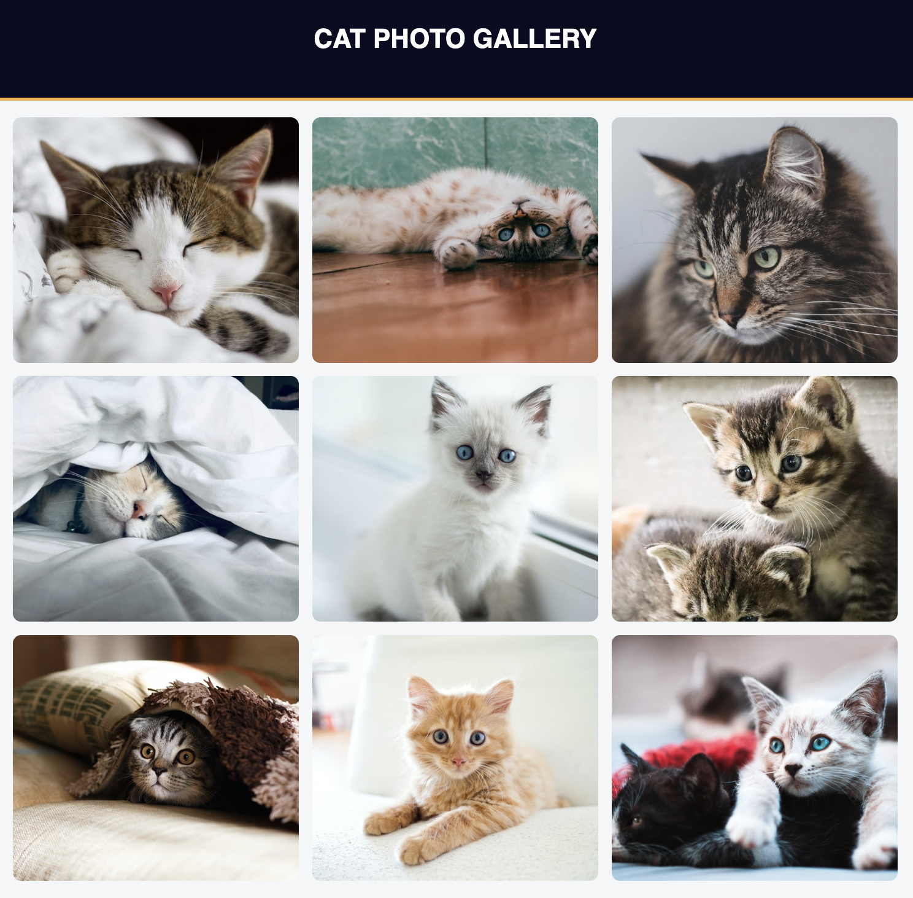

# [Cat Gallery](https://vincentz-42.github.io/freecodecamp/responsiveWebDesign/CatGallery/)

## Description

- A webpage with a gallery of cat photos
- To view the webpage, click [here](https://vincentz-42.github.io/freecodecamp/responsiveWebDesign/CatGallery/)

## Learning Objective

- To build a webpage with a photo gallery of cats using the Flexbox model.

## References

- This is a project that is part of the Responsive Web Design Certification curriculum by [freeCodeCamp.org](http://freeCodeCamp.org)
