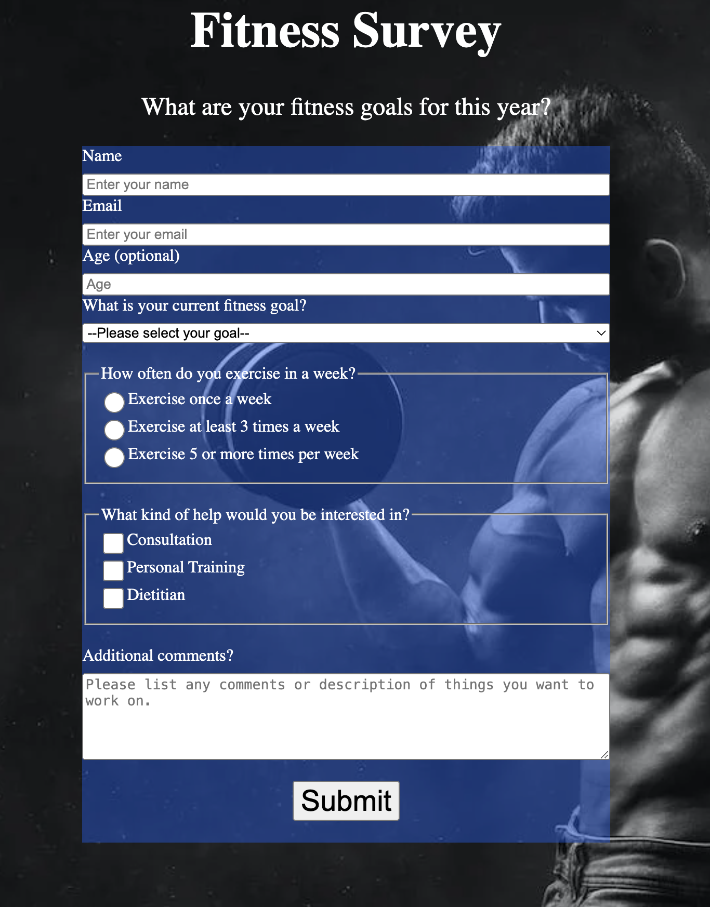

# [Fitness Survey](https://vincentz-42.github.io/freecodecamp/responsiveWebDesign/FitnessSurvey/)

## Description
* A webpage of a Fitness Survey to collect basic information and data of current fitness level and goals
* To view the webpage, click [here](https://vincentz-42.github.io/freecodecamp/responsiveWebDesign/FitnessSurvey/)

## Learning Objective
* To build a survey form to collect information using knowledge of HTML to format the webpage and CSS to format the styling. 

## References
* This is the first certification project in the Responsive Web Design Certification curriculum by [freecodecamp.org](https://freecodecamp.org)