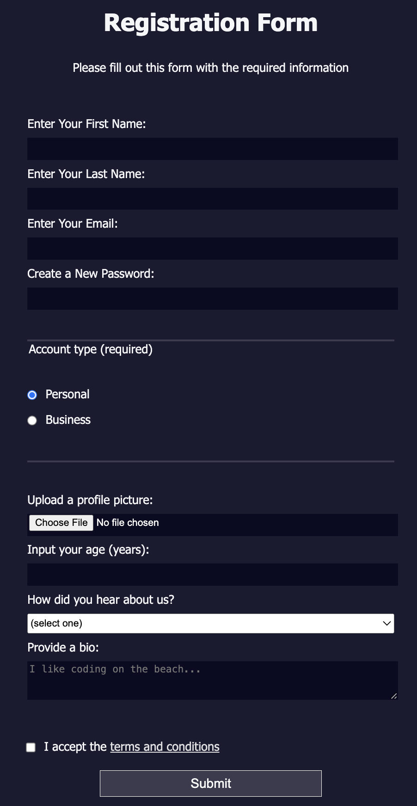

# [Registration Form](https://vincentz-42.github.io/freecodecamp/responsiveWebDesign/RegistrationForm/)

## Description
* A webpage of a Registration Form to stimulate collection of basic information to create an account 
* To view the webpage, click [here](https://vincentz-42.github.io/freecodecamp/responsiveWebDesign/RegistrationForm/)

## Learning Objective
* To learn how collect information using HTML forms by building a signup page as well as how to control types of data people can interact with on the webpage(such as text, radio, file, email, password, and textarea)

## References
* This is the fourth project in the Responsive Web Design Certification curriculum by [freeCodeCamp.org](freeCodeCamp.org)