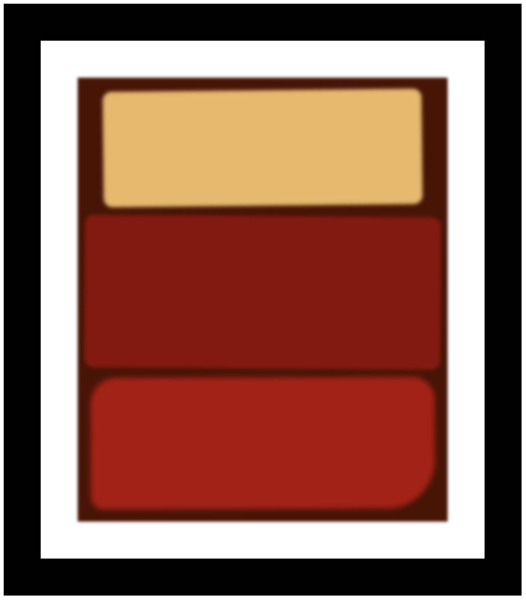

# [Rothko Painting](https://vincentz-42.github.io/freecodecamp/responsiveWebDesign/RothkoPainting/)

## Description
* A webpage containing a digital Color Field painting inspired by Mark Rothko's paintings.
* To view the webpage, click [here](https://vincentz-42.github.io/freecodecamp/responsiveWebDesign/RothkoPainting/)

## Learning Objective
* To learn how to apply the Box Model to webpage design
* To manipulate CSS properties such as border, padding, margin, overflow, filter, blur, box-shadow, border-radius, and transform.

## References
* This is a part of the Responsive Web Design Certification curriculum by [freeCodeCamp.org](http://freeCodeCamp.org)